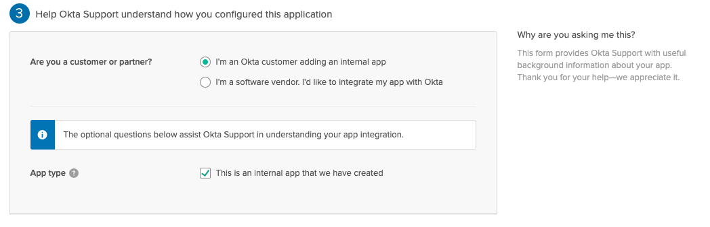

# SAML Proxy Octa \| FSC

## Prisma SaaS

Log in to Prisma SaaS.

Select --> Settings --> SAML Proxy, then toggle to enable Unmanaged Device Access Control Configuration.

Select Identity Provider Settings Add Identity Provider.

**Now we first have to configure an Octa SAML.**

## Octa SAML

Login to Okta.

Select --> Applications Add --> Applications --> Create New App.

Create the new app with a Web platform and SAML 2.0 sign-on method, then Create.

Open Prisma SaaS in a Secondary Tab

Settings -->  Unmanaged Device Access Control --> SAML Proxy --> Identity Provider Settings

press next

Finish

Record values for the following Okta IdP settings in your [planning worksheet](https://docs.paloaltonetworks.com/prisma/prisma-saas/prisma-saas-admin/secure-cloud-apps/add-unsanctioned-device-access-control-to-prisma-saas/configure-unsanctioned-device-access-control.html#id183K9A00O8P_idd5f41c16-2da9-4246-b141-b78af175e7a1), then Download the Okta certificate.

* Identity Provider Single Sign-On URL
* Identity Provider Issuer

Rename the Okta X.509 certificate from CERT extension to either CER or CRT file extension.

From the Prisma SaaS SAML app, select Assign Assign to to add and manage people or groups.

1. Log in to Prisma SaaS, and selectSettingsSAML ProxyIdentity Provider SettingsAdd Identity Provider.
2. Enter your IdP’s name inIDP Name.
3. ClickChoose File and upload the Okta certificate that you downloaded earlier.
4. Specify values for the following Okta IdP settings, using your [planning worksheet](https://docs.paloaltonetworks.com/prisma/prisma-saas/prisma-saas-admin/secure-cloud-apps/add-unsanctioned-device-access-control-to-prisma-saas/configure-unsanctioned-device-access-control.html#id183K9A00O8P_idd5f41c16-2da9-4246-b141-b78af175e7a1), thenSave.
   * IDP Entity ID
   * SSO URL

## Office 365 in Octa

Add Application

