# Initial Setup Prisma SaaS \| FSC

Wait until you get the Email from PAN.

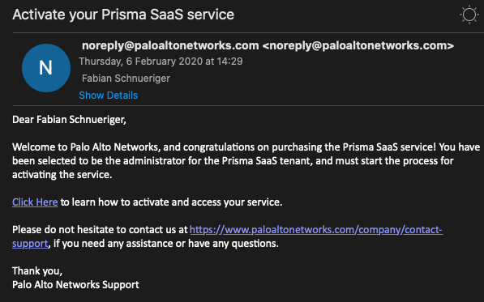

Login: [https://apps.paloaltonetworks.com/apps](https://apps.paloaltonetworks.com/apps)

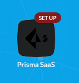

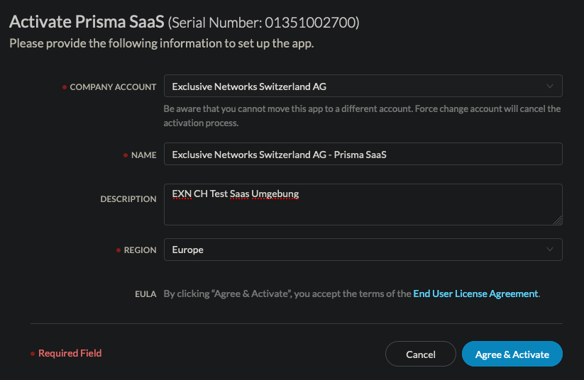

Wait until the SaaS instance is active. This can take a couple hours.

You can check the status on: [https://apps.paloaltonetworks.com/settings](https://apps.paloaltonetworks.com/settings)

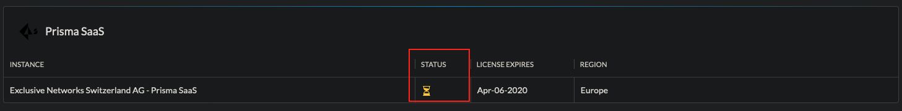

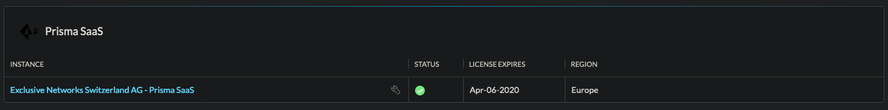

Open Prisma SaaS. You have to login with the Account who got the fullfillment Email. Else you get an Error.

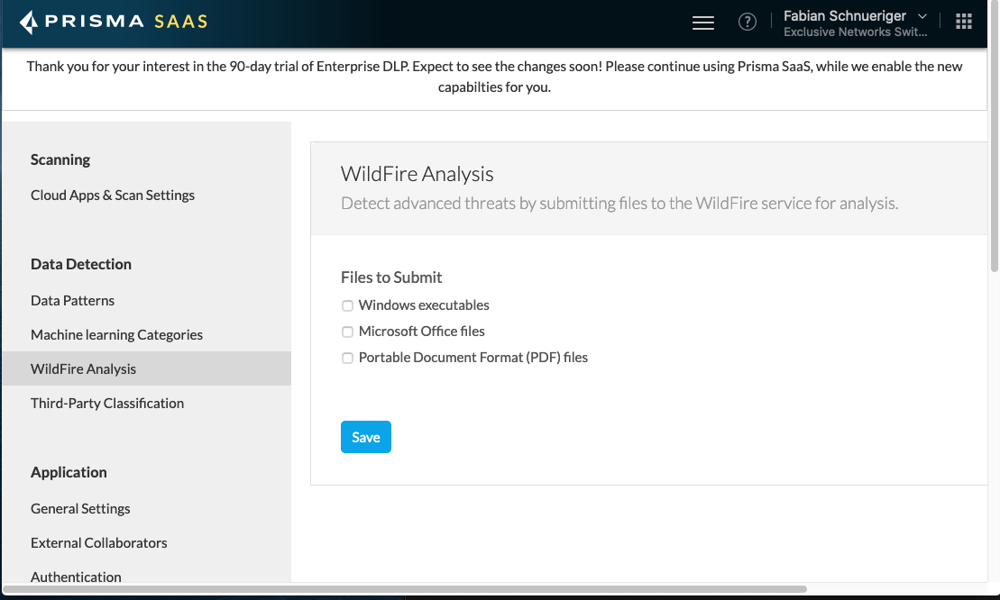

Turn on Files to Submit.

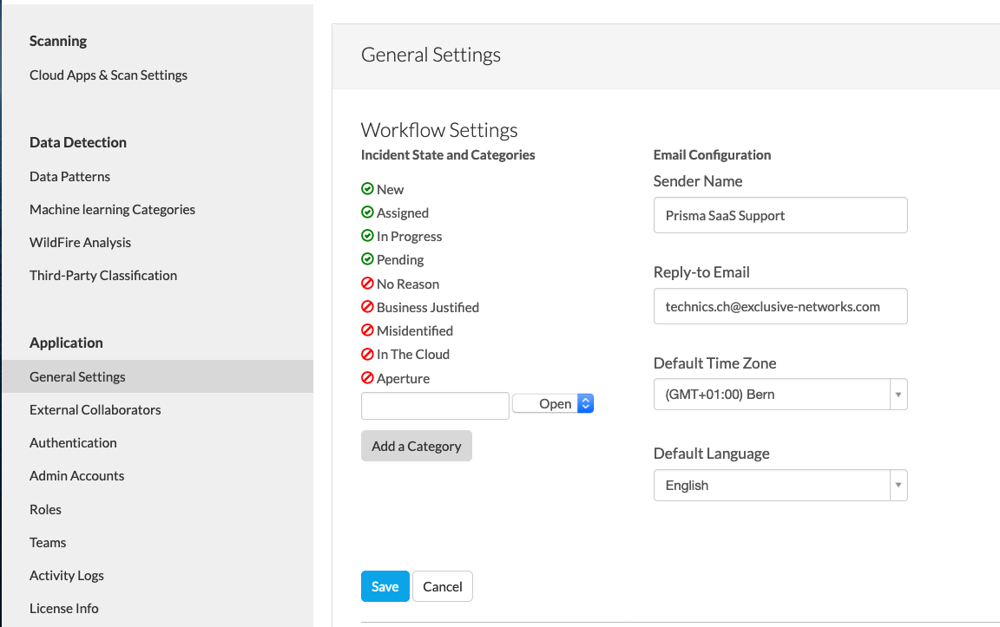

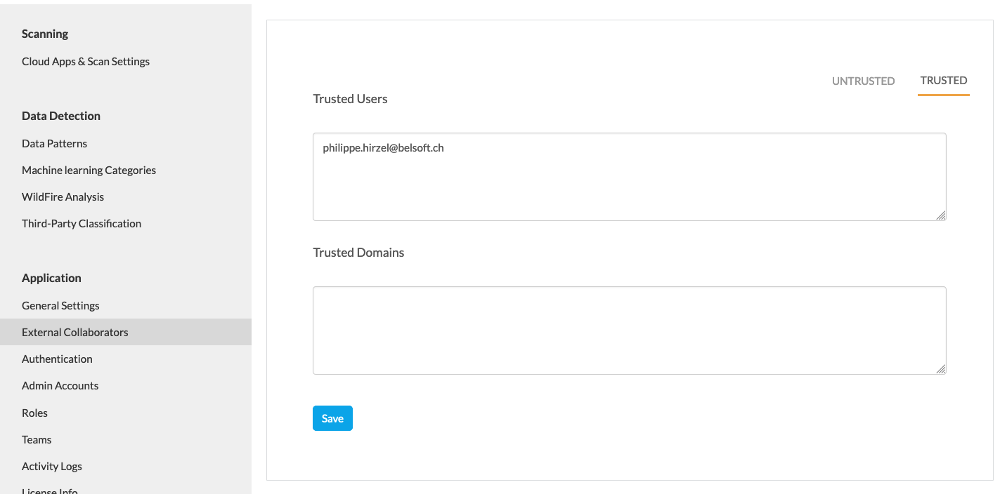

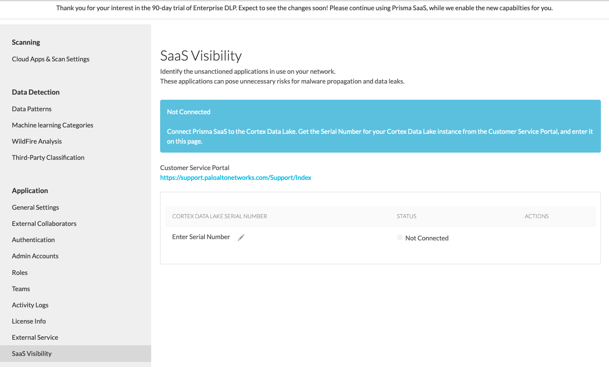

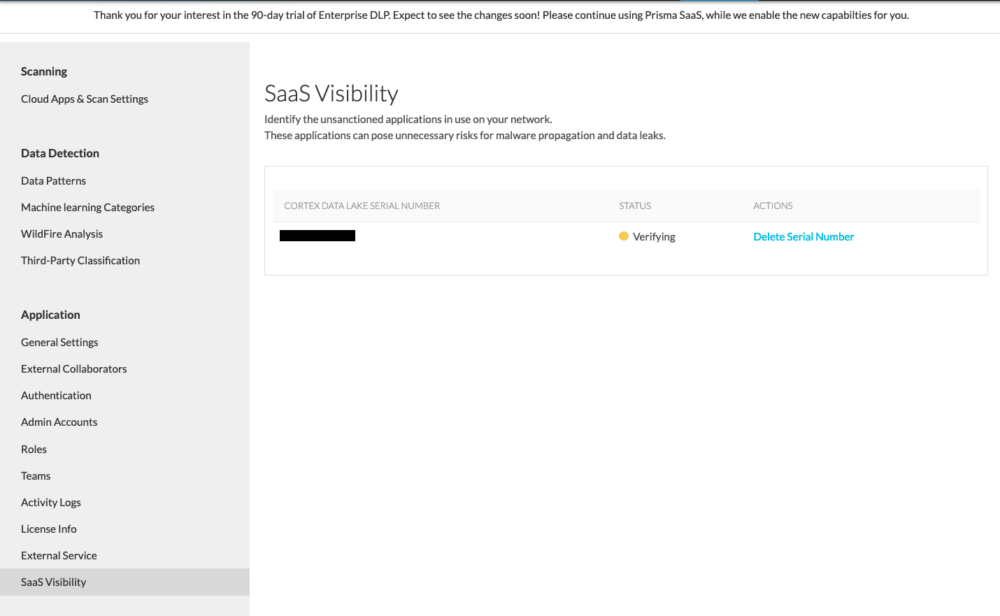

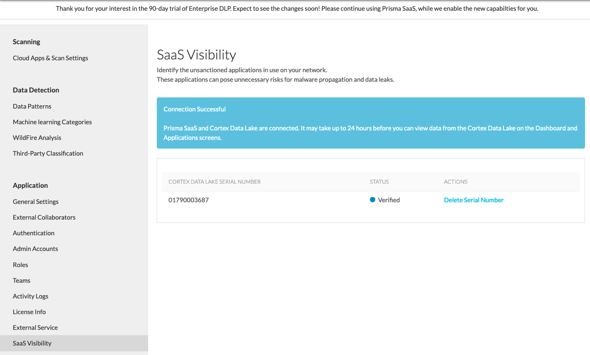

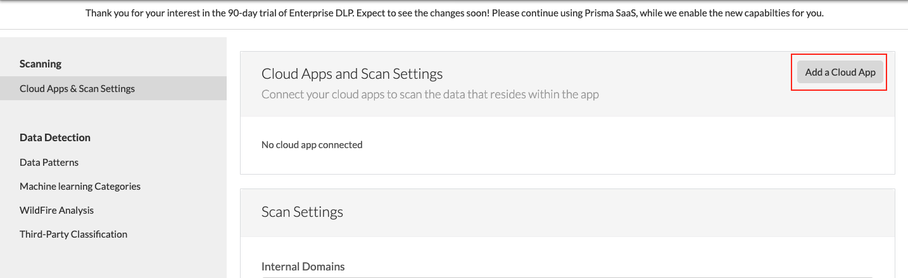

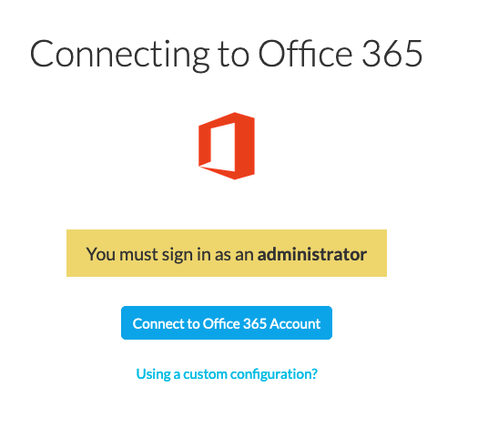

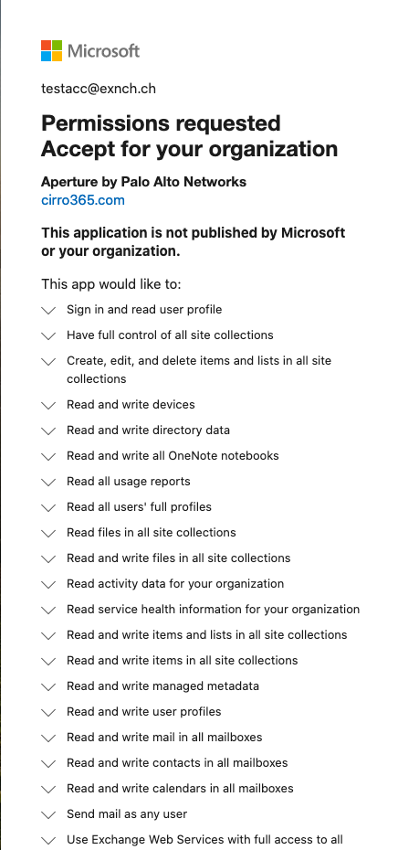

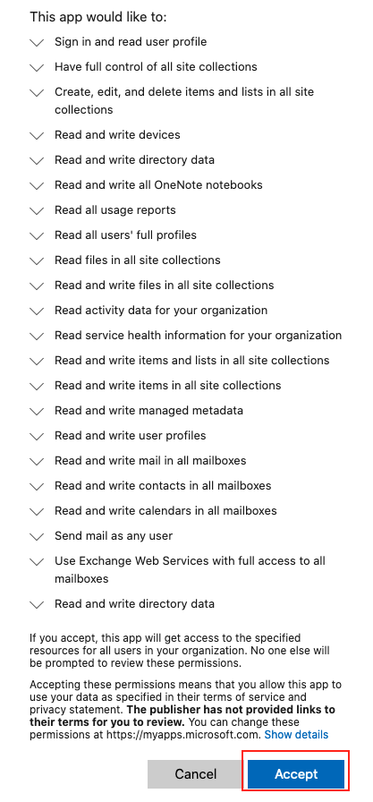

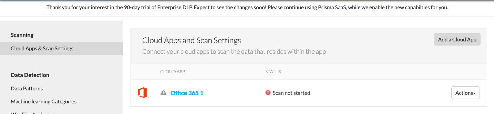

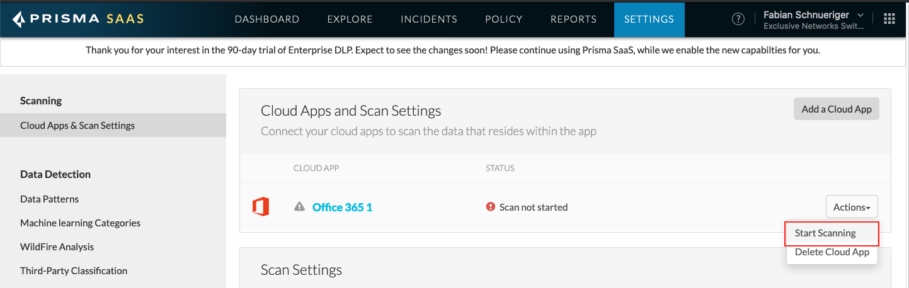

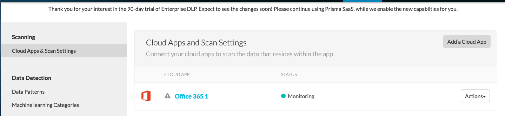

