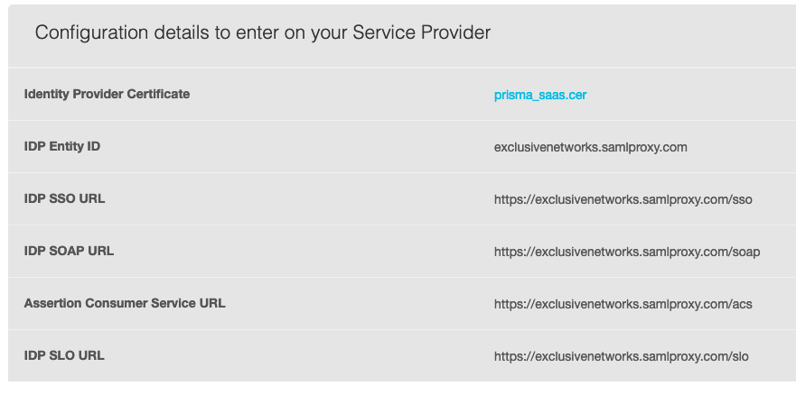
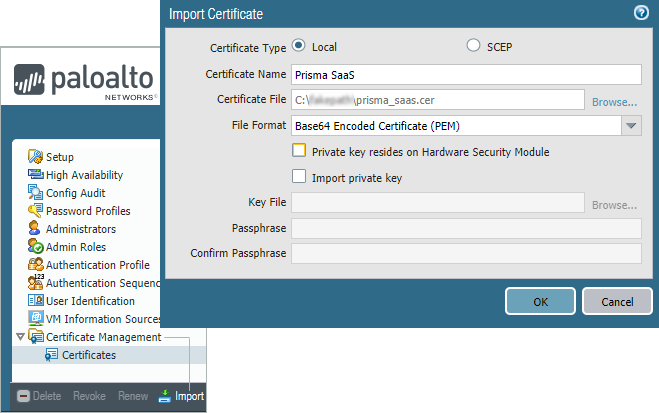
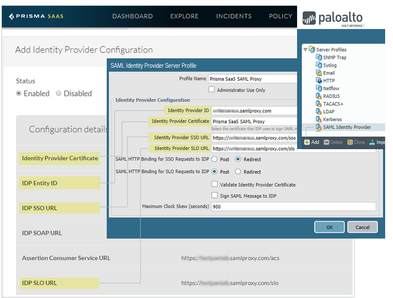
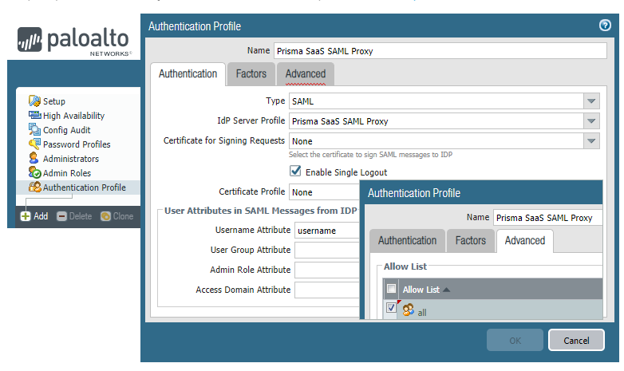
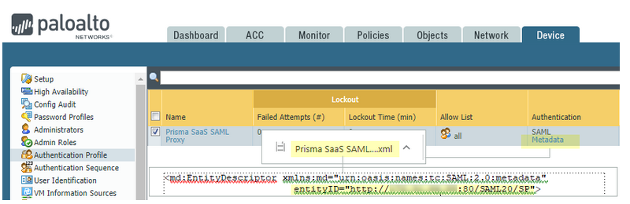
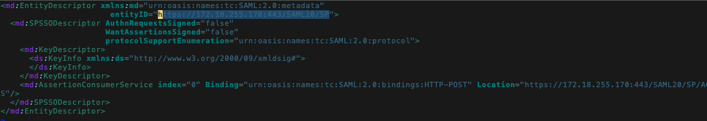
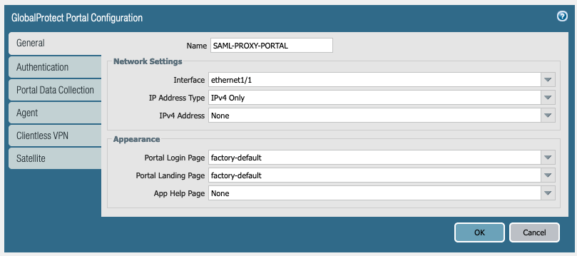
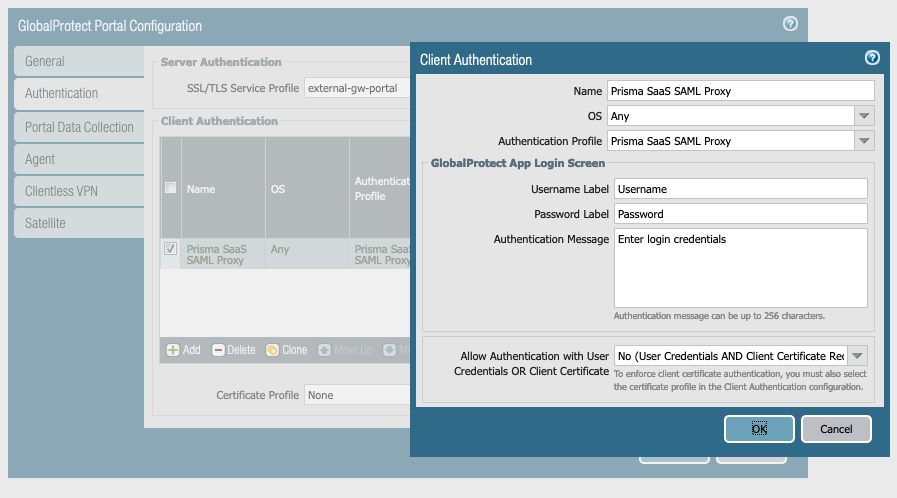
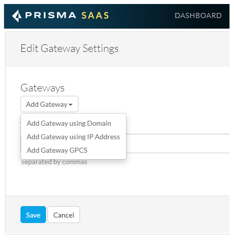

# SAML Proxy PAN Firewall \| FSC

## Import and export the cert

Login to Prisma SaaS --&gt; Settings --&gt; Unmanaged Device Access Control --&gt; SAML Proxy --&gt; Identity Provider Configuration

Download the Idenity Provider Certificate.

Log in to NGFW.

Import the Prisma SaaS certificate prisma\_saas.cer .

## Config SAML Idenitity Provider

Create the SAML **Identity Provider Server Profile** .

* Link to the Prisma SaaS certificate you imported.
* Settings according to the Screenshot

## Create the Authentication Profile

Specify the SAML Identity Provider Server Profile that you created

Locate the SAML Identity Provider Server Profile that you created.

Click on the Metadata link to download and open the file.

Locate and record the Entity ID one the line that begins entityID= .

Create the Client Authentication , specifying the SAML Identity Provider Server Profile

## Configure Gateway Settings on Prisma SaaS

Log in to Prisma SaaS.

Select Settings SAML Proxy Gateway Settings Edit.

